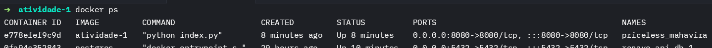

# Atividade 1 - Computação em Nuvem

## Objetivo

Criar, configurar e executar uma aplicação web simples utilizando Flask
(ou outra tecnologia web de escolha) e, em seguida, contêinerizar essa
aplicação usando Docker. O trabalho prático também inclui a criação de um
Dockerfile, a execução da aplicação em um contêiner Docker, e a exposição do
serviço via porta mapeada.

## Dockerfile

```dockerfile
FROM python:3.9-slim

WORKDIR /app

COPY . /app

RUN pip install --no-cache-dir flask

EXPOSE 8080

ENV FLASK_APP=index.py

CMD ["python", "index.py"]
```

### Explicação

- `FROM python:3.9-slim`: Utiliza a imagem oficial do Python 3.9 slim como base.
- `WORKDIR /app`: Define o diretório de trabalho como `/app`.
- `COPY . /app`: Copia o conteúdo do diretório atual para o diretório de trabalho.
- `RUN pip install --no-cache-dir flask`: Instala o Flask.
- `EXPOSE 8080`: Expoe a porta 8080.
- `ENV FLASK_APP=index.py`: Define a variável de ambiente `FLASK_APP` como `index.py`.
- `CMD ["python", "index.py"]`: Executa o arquivo `index.py` com o Python.

## Como rodar a aplicação

1. Clone o repositório:

```bash
git clone
```

2. Entre no diretório do projeto:

```bash
cd atividade-1-computacao-em-nuvem
```

3. Construa a imagem Docker:

```bash
docker build -t atividade-1-computacao-em-nuvem .
```

4. Execute o container:

```bash
docker run -p 8080:8080 atividade-1-computacao-em-nuvem
```

5. Acesse a aplicação em `http://localhost:8080`.

## Projeto em execução


